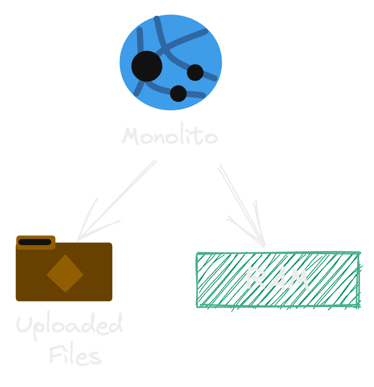
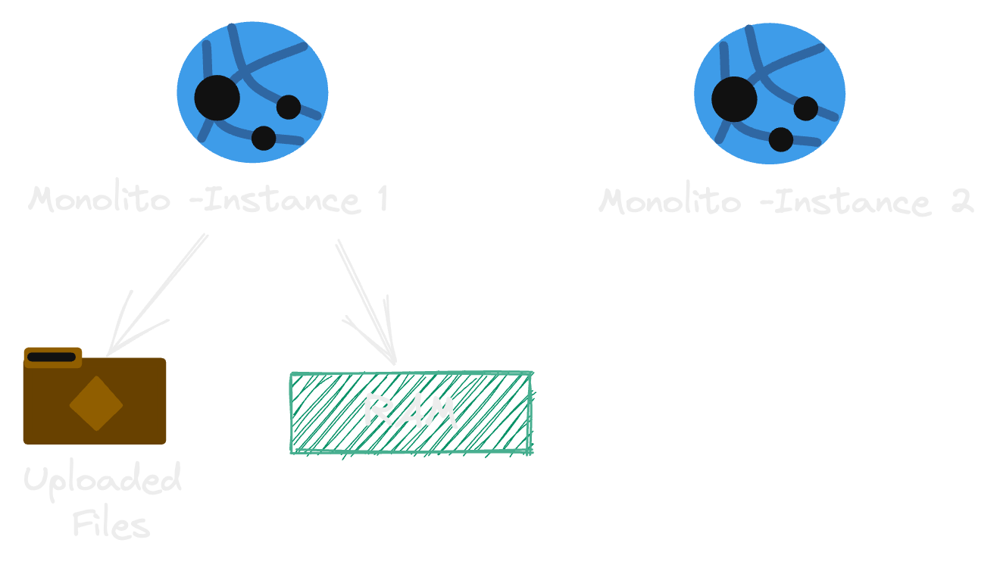
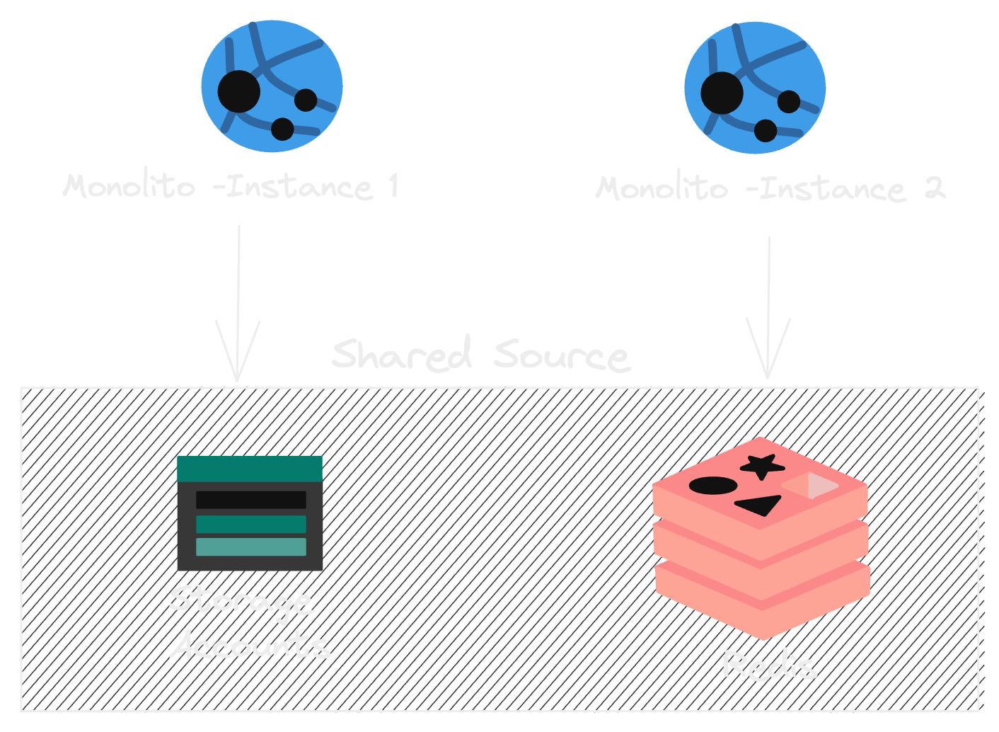
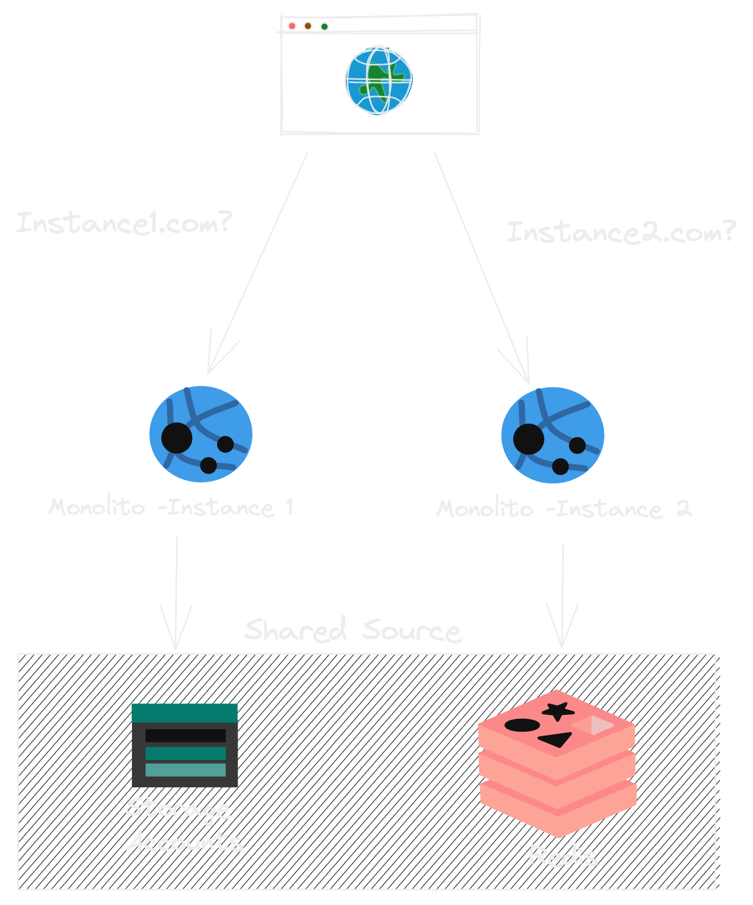
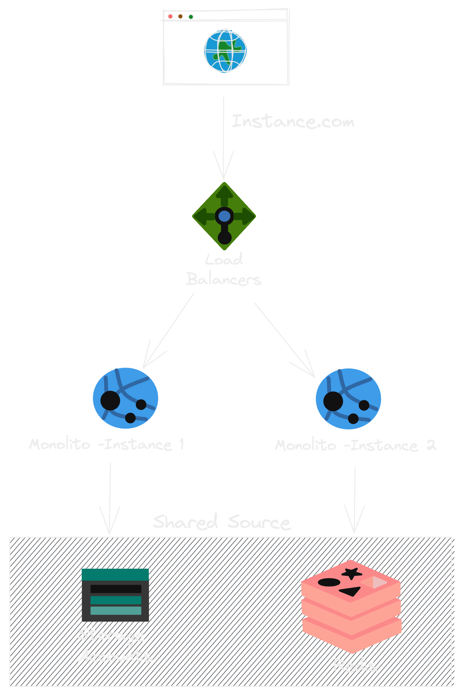
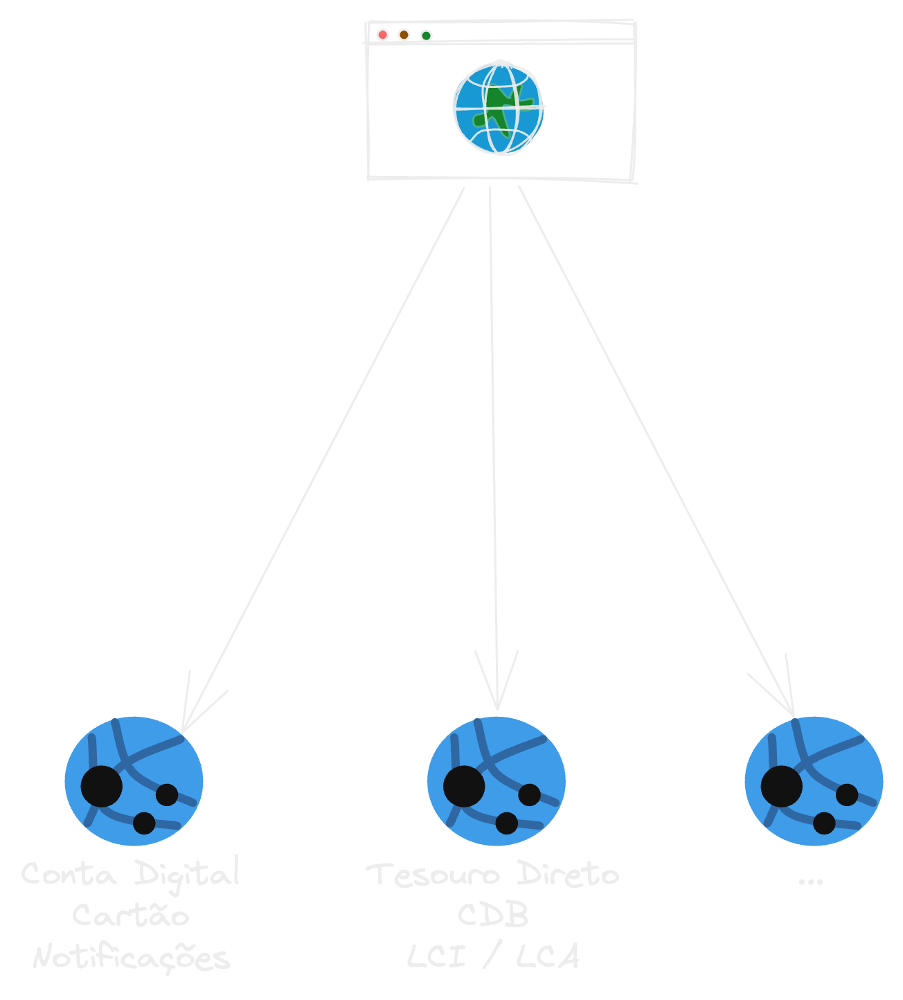
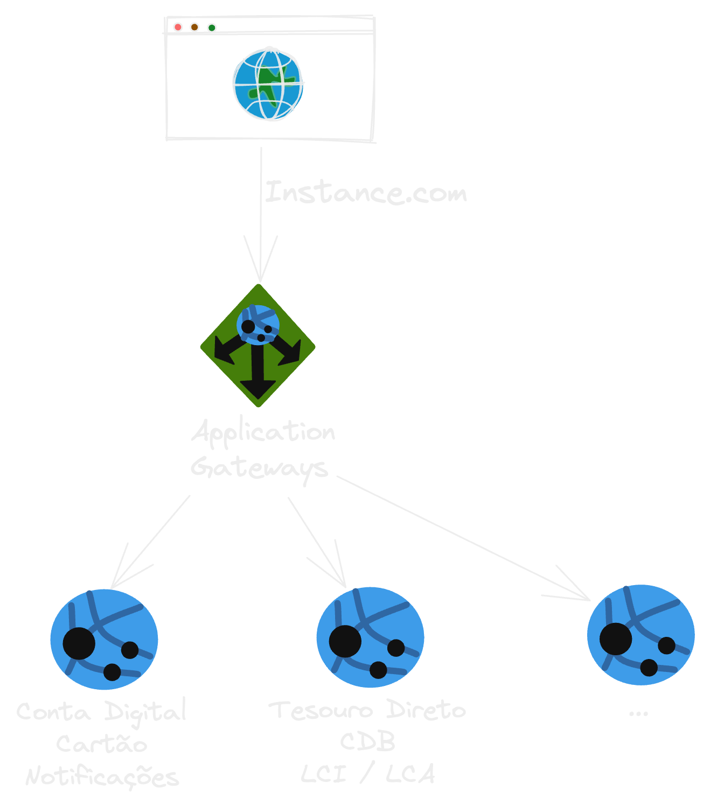
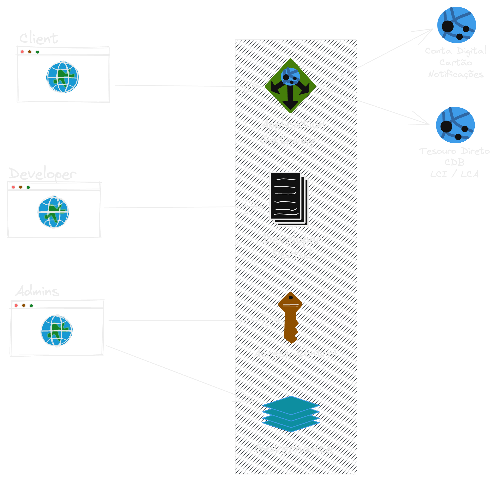
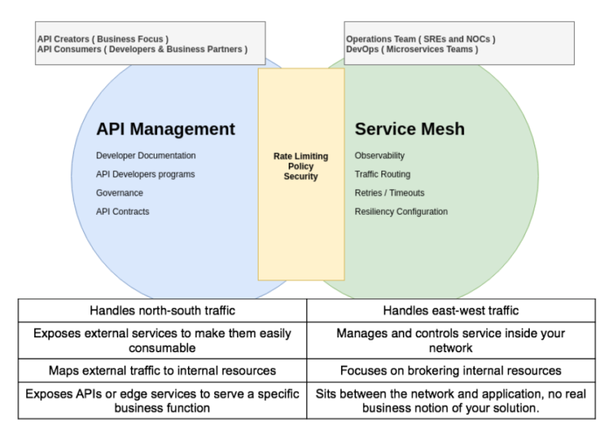
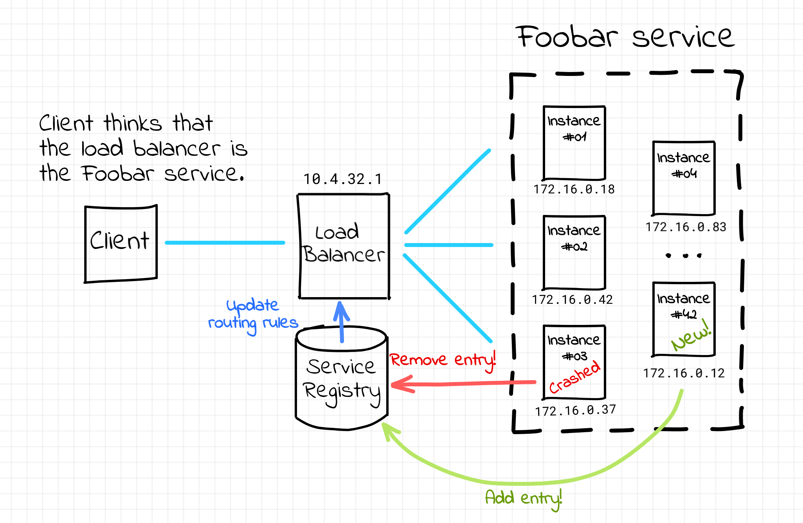

### Distributed Systems

---

### Objetivos

- Dar uma introdução sobre Sistemas distribuídos
- Dar uma introdução sobre Microsserviços
- Conceitos relacionados que sempre aparecem por aí
- Tirar as dúvias

---

### O que é?

---

#### Processamento em mais de um computador

---

A distributed system is a collection of independent computers that appears to users as a single computer. - ANDREW S. TANENBAUM

---

### Obrigado!

---

- Não compartilha memória(entre os serviços)
- Podem ser processados em paralelo
- Baixo acoplamento(um não depende obrigatoriamente do outro)
- Falham de forma independente(se 1 quebrar segue o baile)

---

### Quando usar?

Escala de Time(menos comum)

---

### Quando usar?

Escala de de Sistema

---

### Vertical vs. Horizontal

---

### Todo o sistema pode ser Distribuído?

---

### Caso de um Moniolito

---

### Caso de um Moniolito

- Compartilha memória ou disco

---

### Caso de um Moniolito

- Compartilha memória ou disco
- Session/Files(local)

---

#### Caso de um Moniolito - Como Escalar

{width=50%}

---

#### Caso de um Moniolito - Como Escalar

{width=70%}

---

#### Caso de um Moniolito - Como Escalar

{width=70%}

---

#### Caso de um Moniolito - Como Escalar

{width=50%}

---

### Load Balancer

{width=40%}

---

#### Caso de um Moniolito - Escalam?

<iframe width="560" height="315" src="https://www.youtube.com/embed/BiA_TfW76mc" title="YouTube video player" frameborder="0" allow="accelerometer; autoplay; clipboard-write; encrypted-media; gyroscope; picture-in-picture" allowfullscreen></iframe>

---

#### Caso de um Moniolito - StackOverFlow

<iframe width="560" height="315" src="https://www.youtube.com/embed/7LEWQZim5O4" title="YouTube video player" frameborder="0" allow="accelerometer; autoplay; clipboard-write; encrypted-media; gyroscope; picture-in-picture" allowfullscreen></iframe>

---

### Tirando Monolitos Só existem Microsserviços?

---

### Muito mais que Microsserviços

{width=53%}

---

### API Gatway

{width=53%}

---

#### API Gatway vs. Management

{width=63%}

---

### Service Mesh

---

### Service Discovery

{width=90%}

---

### Microsserviços

---

#### Microsserviços

{ width=65% }

---

### Microsserviços - Princípios

1. Alta Coesão
1. Autônomos
1. Resiliência
1. Observável
1. Centrado no domínio do negócio
1. Automatização

---

### Microsserviços - Comunicação

---

### Orquestração

{ width=60% }

---

### Coreografia

{ width=60% }

---

### Event-Driven

---

### Distributed tracing

---

### Dúvidas?

{ width=90% }
